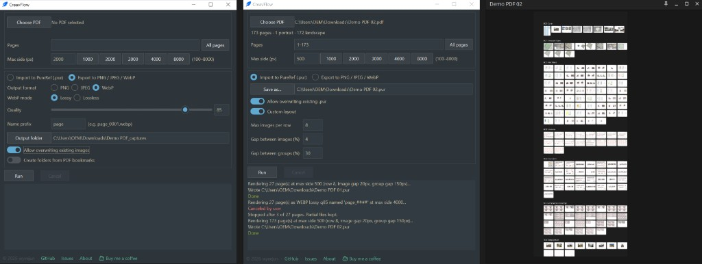

# CreavFlow

Proudly built by a creative, for creatives.
Convert PDF pages into images.
Supports direct import into PureRef.




## Privacy

CreavFlow processes your files locally on your computer.
No account registration required.
Your PDFs and exported images are not uploaded to a server.


## Features

- Import PDF pages straight into a new `.pur` and open it
- Organized based on PDF bookmarks hierarchy (if any)
- PureRef custom layout (images per row, spacing)
- Export pages as PNG, JPEG, or WebP (lossy or lossless)
- Create subfolders based on PDF bookmarks hierachy (if any)
- Cancel mid-run; works fully offline on your computer


## Use

1. Choose a PDF.
2. Type the pages to capture (`1-4, 9`), or click **All pages**.
3. Set the max side (longest side in pixels).
4. Choose an action:
   - **Import to PureRef (.pur)** — builds a PureRef board and opens it. Optional custom layout and overwrite of an existing `.pur`.
   - **Export to PNG / JPEG / WebP** — saves images to a folder. Optional name prefix, overwrite of existing images, and **Create folders from PDF bookmarks**.
5. Click **Run**. If PureRef is not detected for Import, choose **Run anyway** or **Cancel**. Use **Cancel** on the main window to stop mid-run.


## Run from source

```text
python -m venv .venv
.venv\Scripts\activate
pip install -r requirements.txt
python app.py
```


## Windows exe

Prebuilt binaries (when provided) are attached to [GitHub Releases](https://github.com/wyeejun88/CreavFlow_release/releases).

Build locally:

```text
pip install pyinstaller
python -m PyInstaller --noconfirm CreavFlow.spec
```

Output: `dist\CreavFlow.exe`

Windows Defender may flag an **unsigned** PyInstaller exe. Prefer builds from this repo’s Releases, or restore/allowlist if you built it yourself.


## License

CreavFlow is free software under the **GNU Affero General Public License v3** (`LICENSE`).

PDF rendering uses **[PyMuPDF](https://pymupdf.readthedocs.io/)** (AGPL). Distributing CreavFlow (including a compiled `.exe`) with the free PyMuPDF build requires offering corresponding source under AGPL. For proprietary distribution without AGPL obligations, obtain a [commercial PyMuPDF license](https://pymupdf.readthedocs.io/en/latest/about.html#license-and-copyright) from Artifex (or replace PyMuPDF).

Third-party credits: see `NOTICE.txt`.


## Support

CreavFlow is free. If you find this app helpful, please consider [buying me a coffee](https://ko-fi.com/wyeejun).
